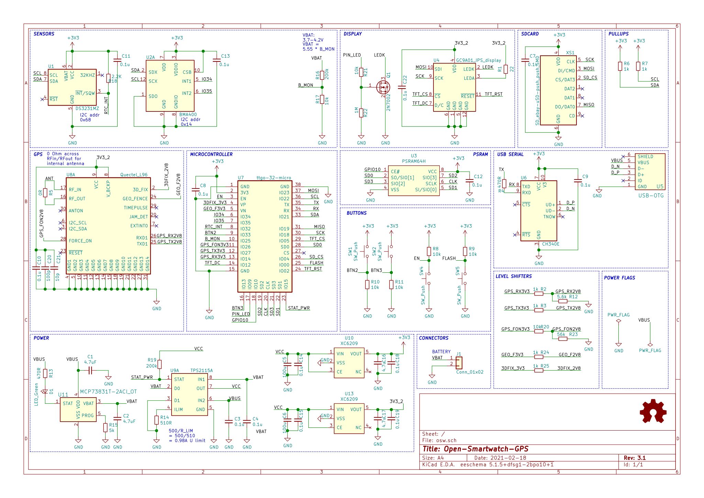

# Open-Smartwatch GPS derivative - Modified by Jit Dey

This repository contains a modified derivative of the Open-Smartwatch GPS hardware project. The derivative work and local modifications are owned and maintained by Jit Dey.

The original hardware design, library references, and upstream project history remain credited to the Open-Smartwatch project. This folder keeps those references where they are required for attribution, license compliance, and KiCad compatibility.

This project preserves upstream Open-Smartwatch attribution and licensing while marking this folder as a modified derivative. See [NOTICE.md](NOTICE.md) for attribution details.

## Project Overview

This project is a KiCad-based hardware design for an ESP32 smartwatch-style GPS board. It includes the schematic, PCB layout, local symbol and footprint references, manufacturing gerbers, board plots, and supporting component documentation.

The design is intended as a compact wearable electronics board with support for a display, GPS module, microcontroller module, power management, USB interface, buttons, sensors, and storage-related circuitry. It can be used as a reference design for studying smartwatch hardware layout, modifying the circuit, or preparing a custom derivative board.

This version is maintained as a derivative by Jit Dey. The goal of this folder is to keep the project organized for further modification while preserving the original Open-Smartwatch source attribution.

## Project Contents

- KiCad schematic files: `osw.kicad_sch` `1759330689451.jfif` and legacy `osw.sch` `1759330713597.jfif`
- KiCad PCB layout: `osw.kicad_pcb` `1759330736489.jfif` `1759330746571.jfif`
- Local symbol and footprint library files under `lib/`
- Generated gerber files under `gerbers/`
- Board preview images and schematic documentation under `docs/`
- Interactive BOM and manufacturing support files
- GPL license and derivative attribution notice

Update 2025-06: There never was a release since the selected GPS module does not work on a wearable-sized PCB, and while worn at the same time.

## Current Status

This hardware project should be treated as a development/reference design, not a finished production-ready smartwatch. The GPS module choice and wearable-sized PCB constraints are known limitations from the upstream project notes. Anyone manufacturing or modifying the board should review the schematic, PCB layout, antenna/GPS behavior, power design, and component availability before ordering boards.

## Tools

## Schematic

## Plots

